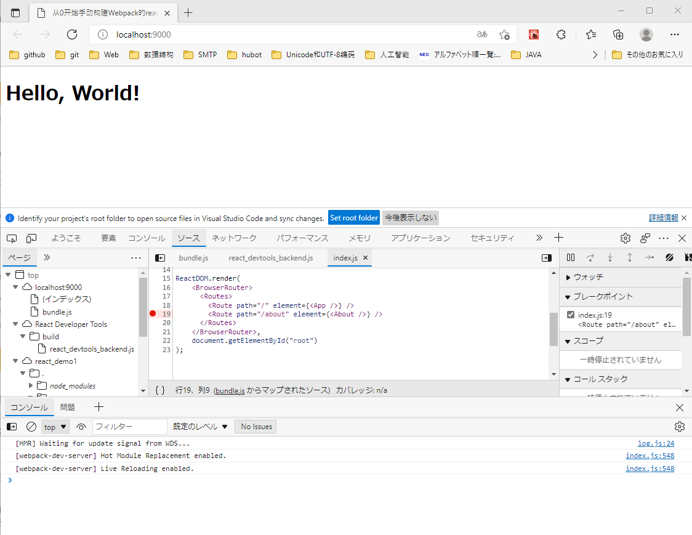

## 前言
这是一个不利用任何脚手架工具，通过Webpack5的手动配置，从0开始手动搭建React开发环境的简单例子。

为什么要自己造轮子？起初是因为自己并不满意市面上的脚手架。另外，造轮子对于自己也有一些技术上的帮助，学别人二次封装的东西，不如直接使用底层的库，这样也有助于自己系统的学习一遍知识。

## 初始化
1. 创建工程文件夹并进入
`mkdir react_demo1 && cd react_demo1`
2. 初始化`package.json`
`npm init`
3. 安装`webpack`
`npm install webpack webpack-cli --save-dev `
4. 创建一下的文件目录
```
react_demon1
|-.babelrc
|-index.html
|-package.json
|-/dist
|-/src
   |-App.jsx
   |-index.js
|-webpack.config.js
```
5. `package.json`信息如下
```
{
  "name": "react_demo1",
  "version": "1.0.0",
  "description": "手动搭建react开发环境",
  "main": "index.js",
  "scripts": {
    "test": "echo \"Error: no test specified\" && exit 1",
     "build": "webpack --config webpack.config.js"
  },
  "author": "wangxing",
  "license": "ISC",
  "devDependencies": {
    "webpack": "^5.64.3",
    "webpack-cli": "^4.9.1"
  }
}
```
## `webpack`最基本配置
1. 编辑`webpack.config.js`
```
module.exports = {
    mode: "development",
    entry: path.join(__dirname, 'src', 'index.js'), // 单文件入口
    output: {
      filename: 'bundle.js',  // 输出文件名
      path: path.join(__dirname, 'dist')  // 输出目录
    },
};
```
2. 编辑`package.json`文件，添加`npm run build`脚本
```
"scripts": {
  "build": "webpack --config webpack.config.js"
},
```
3. 执行`npm run build`，结果`"webpack 5.64.3 compiled successfully`,并且正能常生成`dist/bundle.js`

# `webpack`核心功能配置
[`webpack`更详细的用法及概念](https://webpack.docschina.org/concepts/)

## `Babel`
[`Babel`更详细的用法及概念](https://babel.docschina.org/docs/en/)
1. 安装`babel-loader`
`npm install @babel/cli @babel/core babel-loader @babel/preset-env --save-dev`
2. 编辑`webpack.config.js`,定义`babel-loader`操作
```
module.exports = {
    module: {
      rules: [
        {
          test: /\.(js|jsx)$/,
          loader: "babel-loader",
          exclude: /node_modules/,
        },
      ],
    },
};
```
## 样式
1. 安装`style-loader`,`css-loader`等
`npm install style-loader css-loader less less-loader --save-dev`
2. 编辑`webpack.config.js`,定义`style-loader`,`css-loader`等操作
```
module.exports = {
    module: {
      rules: [
        {
          test: /\.(css|less)$/,
          use: [
            {
              loader: "style-loader",
            },
            {
              loader: "css-loader",
              options: {
                importLoaders: 1,
              },
            },
            {
              loader: "less-loader",
            },
          ],
        },
      ],
    },
};
```
## 图片字体
1. 安装`file-loader`等
`npm install file-loader --save-dev`
2. 编辑`webpack.config.js`,定义`file-loader`操作
```
module.exports = {
    module: {
      rules: [
        {
          test: /\.(png|svg|jpg|gif|jpeg)$/,
          loader: 'file-loader'
        },
        {
          test: /\.(woff|woff2|eot|ttf|otf)$/,
          loader: 'file-loader'
        },
      ],
    },
}
```
## HTML
打包的js文件，需要我们有一个载体来查看结果，也就是我们一般说的模板文件index.html。这个载体文件，不单单是开发环境需要，生产环境也是需要的，但是生产环境我们往往会生成不同的hash值来防止资源缓存，所以每次生成的文件名都是不同的，手动引入入口文件往往不太现实，所以需要借助html-webpack-plugin插件来自动生成项目中的html页面，并实现自动导入对应脚本。

### 使用`html-webpack-plugin` 插件自动创建`index.html`文件
1. 安装`html-webpack-plugin`插件
`npm install html-webpack-plugin --save-dev`
2. 编辑`webpack.config.js`,定义自动生html页面的操作
```
const htmlWebpackPlugin = require('html-webpack-plugin')
module.exports = {
  plugins: [
    new htmlWebpackPlugin({
      template: 'index.html',
      title: '从0开始手动构建Webpack的react开发环境',
    }),
  ],
};
```
3. 编辑模板index.html文件，指定htmlWebpackPlugin中定义的title
```html
<head>
  <title><%= htmlWebpackPlugin.options.title %></title>
</head>
```
## 使用`clean-webpack-plugin` 插件删除之前的打包文件
1. 安装`clean-webpack-plugin`插件
`npm install clean-webpack-plugin --save-dev`
2. 编辑`webpack.config.js`,定义`clean-webpack-plugin`的操作
```
const { CleanWebpackPlugin } = require('clean-webpack-plugin');
module.exports = {
  plugins: [
    new CleanWebpackPlugin(), // 清除之前的打包文件
  ],
};
```
## 开发服务
`webpack-dev-server` 为你提供了一个基本的 `web server`，并且具有 `live reloading`(实时重新加载) 功能。
[`webpack-dev-server`更详细的用法及概念](https://webpack.docschina.org/guides/development/#using-webpack-dev-server)

1. 安装`webpack-dev-server`
`npm install webpack-dev-server --save-dev`
2. 编辑`webpack.config.js`,定义`webpack-dev-server`的操作
```
module.exports = {
  devServer: {
    static:{
    directory: path.join(__dirname, "dist"),
    },
    hot: true,
    historyApiFallback: true,
    compress: true,
    port: 9000,
  },
};
```
3. 编辑`package.json`文件，添加`npm start`脚本
```
"scripts": {
  "start": "webpack serve --open --config webpack.config.js"
},
```
## React的JSX文件处理
1. 安装`babel的预设包`
`npm install @babel/preset-react react react-dom --save-dev`

2. 编辑`.babelrc`，定义`babel的react预设`
```
{
    "presets": ["@babel/preset-env", "@babel/preset-react"]
}
```
## 环境变量
[cross-env的详细](https://blog.csdn.net/Mweb_demo/article/details/100896360)
[cross-env的相关资料](https://www.jianshu.com/p/e8ba0caa6247)
1. 安装`cross-env`
`npm install cross-env --save-dev`
2. 配置`package.json`的`start`和`build`执行脚本
```
"scripts": {
  "build": "cross-env ENV_LWD=production webpack --mode=development --config webpack.config.js",
  "start": "cross-env ENV_LWD=development webpack serve --open --config webpack.config.js"
},
```
## 路由
[react-router的详细说明](https://github.com/remix-run/react-router/blob/main/docs/getting-started/tutorial.md)
1. 安装`react-router-dom`
`npm install react-router-dom  --save-dev`
2. `App.js`的路由例子
```
import {
  BrowserRouter,
  Routes,
  Route
} from "react-router-dom";

function App() {
  return (
    <BrowserRouter>
      <div>
        <h1>Hello, React Router!</h1>
        <Routes>
          <Route path="/" element={<Home />} />
        </Routes>
      </div>
    </BrowserRouter>
  );
}
```

## 确认结果
1. 复制`App.jsx`,`index.js`,`index.html`的类容
2. `npm run build`
3. `npm start`

## 调试
1. 安装`React Developer Tools`
[React Developer Tools](https://reactjs.org/blog/2015/09/02/new-react-developer-tools.html#installation)
### `DevTools failed to parse SourceMap` 警告解决方法
[参考](https://blog.csdn.net/whuhewei/article/details/105565746)
编辑`webpack.config.js`，定义`devtool`操作
```
module.exports = {
  devtool: 'inline-source-map',
};
```



# 参考
https://jishuin.proginn.com/p/763bfbd3bb1c   
https://www.jianshu.com/p/c712fa8bfdff   
https://www.w3cschool.cn/react/react-install.html    
https://react.docschina.org/tutorial/tutorial.html#setup-for-the-tutorial   

